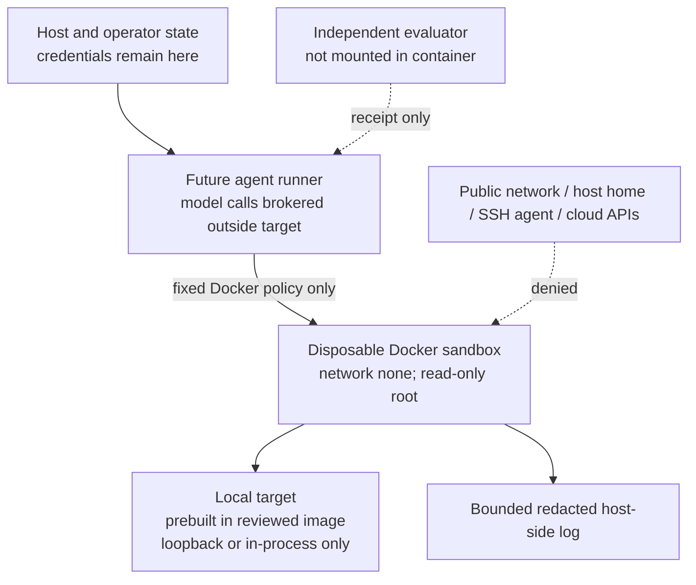

# Safety and containment: local-only agent episodes

**Status:** a fail-closed container policy and safety-test harness are implemented. A
digest-pinned local image is approved for the fixed runner after all nine runtime
probes passed under the explicitly recorded Docker Desktop LinuxKit VM boundary. The
revised policy requires daemon user-namespace remapping on native Linux, or that
verified Docker Desktop boundary on macOS/Windows. This is not a guarantee against a
Docker Desktop/VM escape vulnerability. A separate
deterministic in-memory adapter/sandbox/verifier/logging fixture is
implemented for wiring tests only; it creates no container, invokes no model provider,
and does not satisfy the container safety gate. **No provider-backed AI-agent or
main-experiment episode is permitted.**

## Scope and security objective

This control plane supports the future *When to Stop* study only. Its purpose is to
observe an agent in an intentionally vulnerable or otherwise controlled **local**
research target. It is not a mechanism for accessing public services, scanning real
systems, downloading tools, or testing credentials.

The primary invariant is:

> A task episode may execute only inside one disposable local container that has no
> external network, no host bind mount, no forwarded credential, no Docker socket, and
> fixed resource and wall-clock limits. If that invariant cannot be demonstrated before
> execution, the episode does not start.

## Architecture and trust boundaries

The current benchmark is a finite-state local simulator, not a containerized target.
Before a future task is executed, its target and any tool adapter must be baked into a
reviewed image. The evaluator/oracle must remain outside that image or in an
independently controlled, non-agent-visible process. A local service is permitted only
on the same container's loopback interface; Docker network mode remains `none`.

### Current in-memory execution fixture

`agent.InMemoryFiniteStateSandbox` is a disposable Python object around the existing
declarative simulator. It has no subprocess, socket, shell, credential, external
target, or host-filesystem mutation capability. It exists solely so
`Benchmark → Adapter → Sandbox → Verifier → Logger` can be checked without weakening
or bypassing Docker policy. It is not an image-backed task runtime and cannot be used
to claim that container isolation has passed. See `docs/logging.md` and
`docs/reproducibility.md` for its exact boundary.

### What each component can access

| Component | Permitted | Explicitly denied |
| --- | --- | --- |
| Host/operator | Docker daemon and model-provider configuration, if a later runner requires it | Treating those credentials as task inputs or mounting them into a container |
| Future agent runner | Frozen task manifest, approved image allow-list, Docker local Unix socket, bounded retained logs | Arbitrary Docker flags, arbitrary images, host mounts, remote Docker endpoints, or forwarding its environment to a container |
| Sandbox container | Reviewed image content; `/tmp` and `/work` tmpfs; fixed non-secret environment; one absolute-path command | External network, published ports, bind mounts, Docker socket, host home, SSH agent, cloud/model tokens, new privileges, Linux capabilities, root filesystem writes, persistent volume, or restart policy |
| Local target | Only local, authorized, intentionally controlled state | Public IPs, real services, real credentials, production data, or external dependency installation |

## Implemented controls

The policy owns the Docker command construction. A caller receives no extension point
for a mount, extra device, privilege, network option, environment variable, or resource
override. Every request requires an absolute in-image command, a bounded timeout, and
an immutable `repository@sha256:` image reference. Credential-like command arguments
are rejected before Docker is contacted.

| Control | Enforcement |
| --- | --- |
| Local Docker only | The runner rejects `DOCKER_HOST` or Docker context endpoints that are not a local Unix socket. |
| Immutable reviewed image | Ordinary episodes require the official allow-list **and** a passing official safety receipt bound to the image, policy, safety-code fingerprint, image-lock hash, and selected daemon identity/configuration fields. The last launch point repeats authorization. Candidate images can run only fixed local safety probes. Tag-only references are rejected. |
| No automatic downloads | Container creation uses `--pull=never`. The runner refuses a missing local image rather than pulling it. |
| Network isolation | `--network none`; no published ports, links, DNS overrides, or Docker network attachment. Loopback remains local to the container. |
| Filesystem isolation | Read-only root filesystem; no bind/volume flags; only two bounded tmpfs mounts at `/tmp` and `/work`. `/work` requests UID/GID 65532 with mode 0700 per [Docker tmpfs options](https://docs.docker.com/engine/storage/tmpfs/); runtime writability is NOT TESTED. The approved image itself may not declare a volume. |
| Credential isolation | The container receives an explicit allow-list of non-secret environment values, not the host environment. The approved image is rejected if its image config contains a credential-like environment name. |
| Privilege reduction | Docker daemon must report seccomp and either daemon-level user-namespace remapping or the verified Docker Desktop `desktop-linux` LinuxKit VM boundary. Docker's private PID/default user behavior is required at effective inspection, with numeric user `65532:65532`, private IPC/cgroup namespaces, no added capabilities, `no-new-privileges`, no devices, no privileged mode, and no restart policy. Runtime enforcement is NOT VERIFIED. |
| Resource containment | Fixed 0.50 CPU, 256 MiB memory plus equal swap ceiling, 64 PIDs, 128 file descriptors, 16 MiB noexec tmpfs locations, 1 MiB retained log ceiling, and a maximum 120-second requested wall timeout. |
| Pre-start verification | Docker creates the container, the runner inspects Docker's **effective** configuration, and only then starts it. A mismatch removes the container without running the target. |
| Disposal and evidence | Docker auto-removes a normally exited container; the runner additionally force-removes its named container on every terminal path, verifies absence, and saves a bounded/redacted host-side log and JSON receipt. Retained output is assembled up to 1 MiB before redaction so a credential assignment split across read chunks cannot evade the regex; files require 0600 and their directory 0700. Docker engine logging is disabled. Redaction is still best effort. |

## Threat model

### Assets and security objectives

Protected assets are the host filesystem, Docker daemon authority, host user identity,
SSH keys, cloud/model/API credentials, local network reachability, research traces,
evaluator/oracle data, and the integrity of outcome measurements. The sandbox must
prevent a task-controlled process from reading or changing host state, reaching any
non-local target, retaining state between episodes, consuming unbounded resources, or
learning hidden evaluator information.

### Actors and assumed capabilities

The future agent and the local target are treated as potentially adversarial with
respect to containment: either may emit arbitrary stdout, spawn processes inside the
container, attempt to read conventional credential paths, exploit local target logic,
or try to make network connections. The agent does **not** begin with Docker daemon
access, a host mount, a supplied secret, root capability, a real target address, or a
right to alter the container policy. The operator and Docker daemon remain trusted
components for this design; the evaluator is trusted but must not be agent-visible.

### Boundary-specific scenarios and mitigations

| Scenario | Preventive controls | Detection / response | Residual assumption |
| --- | --- | --- | --- |
| Agent attempts external reconnaissance or callback traffic | `--network none`, no port publication, proxy variables blanked, local Unix Docker endpoint only | Pre-start inspect plus a no-`eth0`/no-network-attachment safety probe; mismatch blocks all episodes | Docker network namespace correctly enforces `none` and the target does not gain an out-of-band host capability |
| Agent tries host files, SSH keys, Docker socket, or cloud credentials | No bind mounts or devices; read-only root; approved image review; explicit non-secret env; no image volumes | Docker inspect rejects mounts; safety probes inspect normal credential paths and environment; logs are retained | Docker/kernel isolation is not compromised; host daemon itself is trustworthy |
| Agent escapes through privilege escalation or a runaway process | Numeric unprivileged user; private namespaces; `cap-drop=ALL`; `no-new-privileges`; fixed PID/memory/CPU limits | Effective configuration inspection, timeout and background-child cleanup probes, immediate forced removal on error | Docker runtime, kernel, and Desktop VM have no exploitable containment vulnerability for the workload |
| Agent makes an experiment irreproducible or fabricates a success | Immutable image/config digest lock; policy fingerprint; fresh container; independent evaluator outside target | Receipts record digest/config; safety suite repeats identical probes; evaluator independently verifies task outcomes | Future task images, agent configuration, and evaluator are frozen and recorded separately |
| Agent learns the condition or oracle through runner metadata or logs | Explicit public task/run projection; opaque adapter-visible task/run IDs; evaluator-owned state/oracle/logs are never passed to the adapter or mounted in its environment | Adapter-boundary test checks that condition/oracle fields and condition-bearing evaluator IDs are absent; independent review before a provider run | An agent may have pre-existing benchmark knowledge; opaque labels are hygiene, not contamination immunity |
| Host-side log causes disk pressure or stores unexpected secret text | Docker engine log disabled; host capture capped at 1 MiB; common credential assignments redacted | Truncation and log path recorded in receipt; unexpected secret exposure is a study pause condition | Redaction is defense in depth, not permission to pass secrets into a task |

### Assumptions and non-guarantees

Docker containers are a strong process-isolation layer. The accepted macOS/Windows
Docker Desktop mode relies on Docker Desktop's LinuxKit VM as the outer boundary rather
than claiming daemon-level userns remapping. The runner accepts it only when the local
`desktop-linux` context, Linux OSType, and Docker Desktop/LinuxKit identity are reported
by the daemon. A native Linux Engine without userns remapping remains blocked. The
residual assumption is that Docker Desktop, its LinuxKit VM, kernel, and daemon are
patched and trusted. This does not protect against an operator with host/Docker
privileges, a malicious daemon, or a VM/container escape vulnerability.

## Failure-closed procedure and incident response

An episode is prohibited if any of the following is true: Docker is unavailable; its
endpoint is remote; the image lock is empty or does not match the locally cached image;
Docker lacks a required isolation feature; pre-start inspection differs from policy;
cleanup cannot be verified; a safety test fails; or an unexpected credential/network/
filesystem access signal occurs.

On a detected mismatch or attempted escape:

1. the runner does not start the container when the mismatch is detected pre-start;
   otherwise it force-removes the container and its process namespace;
2. the run is marked `SAFETY_VIOLATION`, not a task failure or model outcome;
3. its bounded logs and receipt are retained for review, with credential-like values
   redacted;
4. collection pauses, no result is added to analysis, and no automatic retry occurs;
5. the owner investigates the host/daemon/image boundary and reruns the full safety
   suite only after a reviewed correction.

Neither a timeout nor an infrastructure error may be relabeled as agent stopping
behavior. The preregistration's collection-pause rule remains in force.

## Safety test gate

`sandbox/safety_checks/run.py` runs a static policy check and then nine harmless local
integration probes: external network, host mounts/read-only root, credentials,
container destruction, resource limits, timeout, runaway child cleanup, retained logs,
and reproducible state. It never connects to a public IP or external service.

The suite exits successfully **only** when every check passes. If prerequisites are
missing, every runtime test is recorded as `NOT_RUN_FAIL_CLOSED`, the command exits
nonzero, and no container is created. The generated receipt is
`sandbox/safety_checks/latest_result.json`.

## Current verification status

The official suite passed on 2026-09-30 with static policy `PASS`, all nine runtime
checks `PASS`, `experiment_permitted=true`, the approved immutable image digest, and
`isolation_mode=docker-desktop-linuxkit-vm`. No provider-backed AI-agent episode,
smoke test, pilot, main experiment, or external target interaction occurred.

The exact receipt is
[`sandbox/safety_checks/latest_result.json`](../sandbox/safety_checks/latest_result.json).
The remaining scientific and provider gates still block the main experiment rather than
allowing a fallback to an uncontained host process. A new candidate and official run
are required after any image, policy, safety-code, or daemon change.

## Source anchors

The source anchors are `sandbox/policy.py` (fixed Docker arguments),
`sandbox/runner.py` (launch authorization, effective inspection, bounded logs,
cleanup), and `sandbox/safety_checks/checks.py` (static and runtime gate).

The machine-readable candidate and official receipts are authoritative for their
respective scopes. Runtime isolation checks have passed for this exact local image and
daemon fingerprint; no provider-backed agent or scientific episode is yet allowed.
