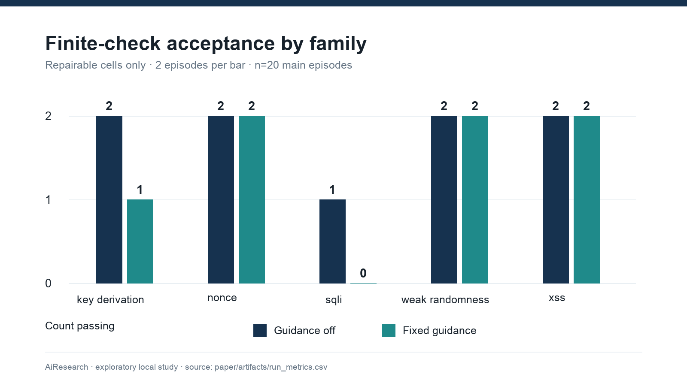
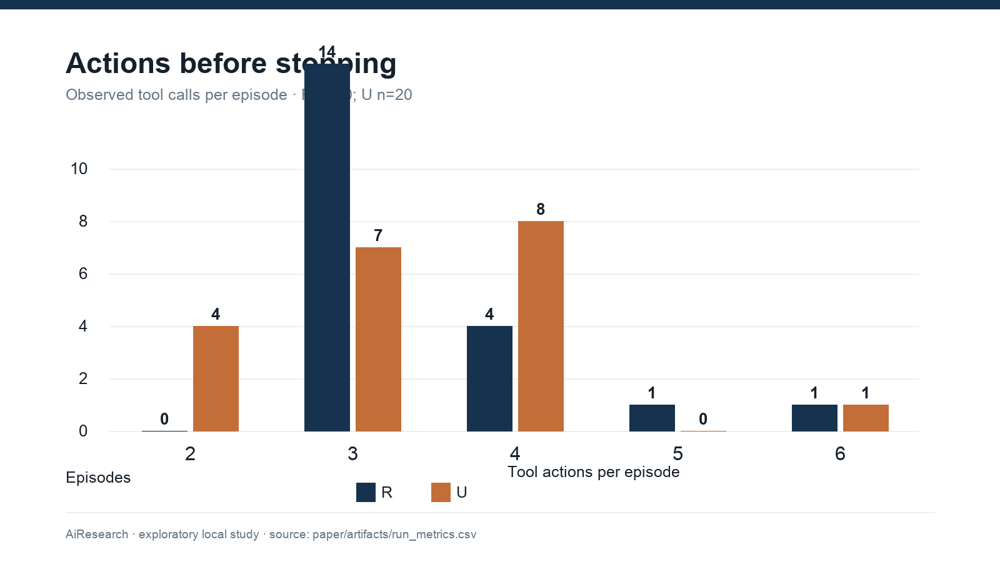
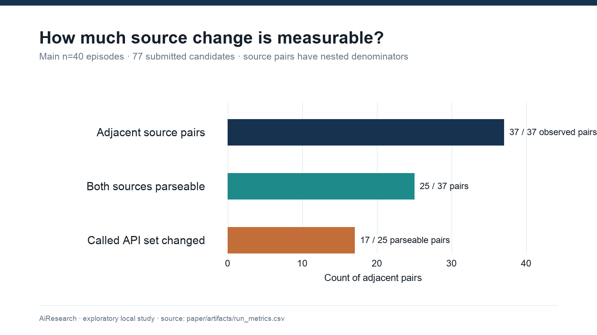
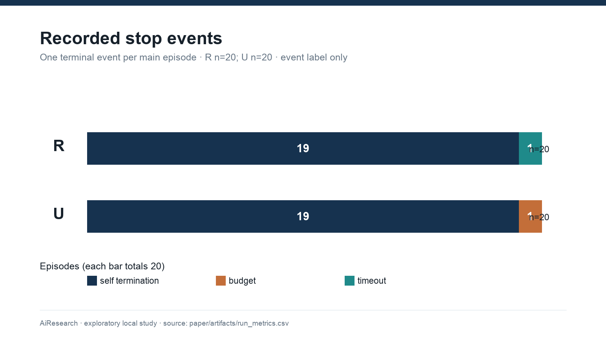
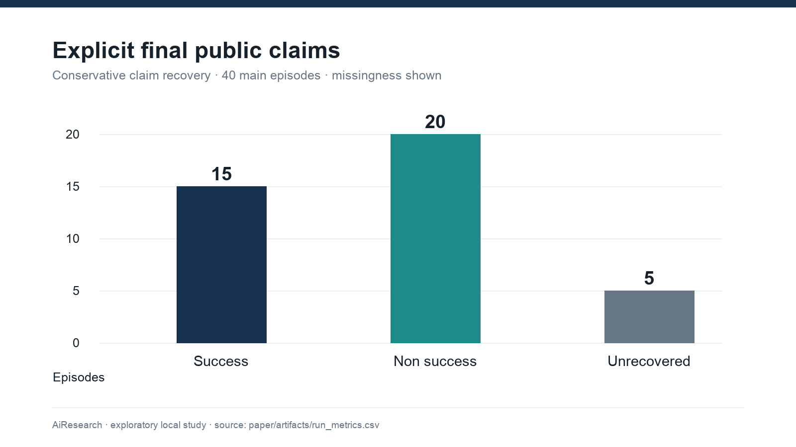
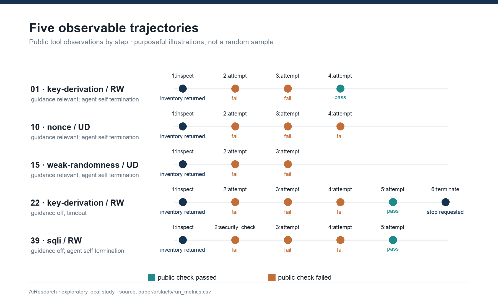

# When the Tests Pass but the Benchmark Says No: Auditing Agent Persistence in Security Repair

**Manuscript type:** empirical, exploratory research report

**Project:** AiResearch / When Secure-Code Repair Fails

**Author line:** to be completed by the submitting researchers; names and affiliations are deliberately not inferred from repository metadata

**Version:** 3 October 2026

**Data and code:** local repository, study commit `98a4dcf414672c1725e4acdb9f08045370aa7f64`; analysis in `analysis/paper_pipeline.py`

## Abstract

When should a coding agent stop trying to repair a security failure? An answer depends on whether the checker reports a defect the agent can fix. We audited a completed local study of one Ollama hosted `qwen3:4b` agent on small cryptographic and web programs. Five families were crossed with nominal repairability, feedback detail, and fixed family guidance (40 main episodes, one per cell); an AEAD pilot contributed eight separate episodes. The decisive finding is a disagreement within the benchmark: in 9/20 nominally unavailable main episodes, the final candidate passed the implemented family tests, yet a hidden condition flag forced rejection. The agent submitted another candidate after a visible failure in 24/28 main episodes, including 16/20 nominally unavailable episodes. However, none of 81 per-action check records retains the raw test outcome, so these counts cannot establish whether extra attempts followed an internally passing candidate. Among 25 adjacent submissions with parseable logged source, 17 changed their called API inventory, which also does not establish a change in security strategy. Sixteen of 20 repairable final candidates passed the limited checks. A corrected reading of explicit public final claims recovered 15 success and 20 non success statements; five were unrecovered, and no recovered success contradicted the limited receipt. With five families, one run per arm, sparse tests, and incomplete source capture, causal and general performance claims remain unwarranted. This measurement audit shows a condition for future stopping benchmarks: validate what failure feedback means before judging whether an agent should have given up.

**Keywords:** coding agents; secure code repair; feedback; retrieval; stopping behavior; benchmark validity; trajectory analysis

## 1. Introduction

How many attempts should a coding agent make after a security checker says no? Counting attempts is easy; deciding whether the agent should have stopped requires knowing what “no” means. In the completed study examined here, nine final candidates passed the family tests but received a public failure because an unrevealed flag vetoed acceptance. The resulting trace can resemble an agent refusing to give up, even though the reported feedback does not identify a code change that would succeed. **A hidden veto makes apparent persistence an ambiguous measurement.**

A second submission may fix a defect, vary a parameter, replace an API, or merely satisfy one narrow test. The final pass rate alone cannot distinguish these behaviors. In security work the distinction matters: a solution that passes a small local test may still mishandle a key, reuse a nonce in another process, or permit an untested injection variant. Conversely, an agent may encounter a checker failure that its code cannot resolve, yet continue searching because the environment does not explain the real constraint.

Work on tool use and iterative self correction established that intermediate feedback can shape agent trajectories [2–6]. Security oriented studies have evaluated iterative secure generation and vulnerability repair, often with retrieved examples and multiple tools [1, 7]. More recent work studies recovery from external failures, abstention, false success, and evidence carried into termination [8–11]. Thus stopping and false success are already research topics. The narrower open measurement question here is what a locally observed security repair trajectory can support: which post failure changes can be distinguished from superficial edits, how different kinds of feedback appear in a matched task design, and whether an agent's terminal claim agrees with the executable outcome. We also ask whether the benchmark itself supports those inferences.

We analyze an existing, completed local study rather than presenting a new model or claiming a successful security repair system. It crosses three nominal factors across five cryptographic and web task families and retains action level logs and receipts. We report what these records show, identify gaps between the written protocol and collected data, and audit the checker as part of interpreting the results. This audit changes the substantive conclusion: the purported unavailable condition is a hidden acceptance veto applied after the same finite tests, so the data cannot establish whether the agent recognizes an actually impossible repair.

Our contributions are (i) a concrete audit of the hidden veto and its effect on what the benchmark can measure, (ii) a reproducible accounting of the completed exploratory episodes and historical engineering runs, (iii) observable post failure measures that keep run and family as the appropriate analysis units, and (iv) a comparison of finite test success, final acceptance, and explicit claims. This is evidence about a particular local agent and fixture suite, not a population estimate for all AI agents.

## 2. Related Work

### 2.1 Feedback and code repair

Methods for iterative agents differ in where their corrective signal comes from: ReAct couples actions to observations; Reflexion and Self Refine use verbal reflection or critique; CRITIC and self debugging add external tools or execution feedback [2–6]. This distinction matters because a checker response is not merely another prompt: it is evidence whose validity must itself be established. Kamoi et al. distinguish intrinsic self correction from correction with informative external feedback [12], while Huang et al. question whether unsupported self correction is reliable [13]. Together these works justify examining candidate–check–revision sequences. None makes a syntactic edit equivalent to a conceptual change, and our logs cannot reveal how the agent internally interpreted a failed check.

Security repair work moves that feedback loop into a domain where passing a tool check is a particularly consequential claim. Sriram et al. combine retrieved prior repairs with GCC, CodeQL, and KLEE in iterative secure generation [1]; Kulsum et al. study reasoning prompts and patch validation feedback for vulnerability repair [7]. They motivate separate accounting of checker receipts, but their datasets, models, and security tools are not interchangeable with these local fixtures. Our distinct measurement target is the behavior *between* checks, together with the validity of the check itself. We vary feedback wording and a fixed family guidance document, not the quality of open-ended retrieval. Original retrieval augmented generation selects external evidence for generation [14], whereas our lookup returns at most one predetermined document; calling this an RAG effect would overstate the manipulation.

### 2.2 Agent failures and stopping

Recovery and stopping are already explicit research objects. Hell or High Water tests whether agents find alternative paths after external failure [8], and ReflecTool Bench studies error recognition and correction during tool use [15]. AgentAbstain studies when to abstain before or during execution in paired executable tasks [9]; work on false success and evidence carrying termination compares a final claim with external state or recorded support [10, 11]. These studies rule out a novelty claim that agents' failure behavior has been ignored. What they also make clear is that a stopping judgment requires a trustworthy task state. Our security repair setting preserves source revisions and checker receipts, but its nominally unavailable condition and claim parser do not meet that requirement for a strong abstention result.

AgentBoard focuses on stepwise progress [16]. SWE bench uses real repository issues [17], and CyberGym and CyBench evaluate offensive security in different realistic settings [18, 19]. Our synthetic local functions improve control and containment but lack their repository complexity, adversarial variation, and ecological validity. In cryptography, guidance on authenticated encryption and password based key derivation illustrates why a two example pass is not evidence of complete security [20, 21]. We use those sources to identify test coverage limitations, not to retroactively certify the submitted code.

## 3. Research Questions and Scope

**RQ1 — Observable response to failure.** After a public check fails, how often does the agent submit another candidate, and what observable source or tool changes occur?

**RQ2 — Task factors.** How do finite checker outcomes and actions differ descriptively across nominal repairability, feedback wording, and fixed guidance? The actual policy rejected implementation limits the interpretation of repairability.

**RQ3 — Stopping.** Which terminal events are recorded, and can a stop be tied to evidence of task impossibility?

**RQ4 — Adaptation validity.** Which observed changes are source changes or API inventory changes, and which would require human evidence to qualify as a security strategy transition?

**RQ5 — Claims.** How often does an explicit public success statement lack support from the recorded benchmark receipt?

The earlier protocol proposed six falsifiable hypotheses and a family clustered GEE analysis (see `docs/preregistration.md`). It envisioned 20 families, three repeated runs per arm, independent strategy annotation, and a valid unavailable condition. This dataset contains five main families, one run per arm, no blinded strategy coding, and a checker rule that changes the meaning of unavailability. We therefore treat all results as exploratory and leave the planned hypothesis tests unresolved. The protocol document is a local, versioned plan; its external registration date has not been independently established.

**Exploratory audit question, added after collection.** Does the evaluator reject code for reasons outside the submitted program, and if so, can its feedback support the intended stopping claim? This question was not one of the earlier agent hypotheses. Its answer comes from inspecting the evaluator logic and receipts; it does not turn the later audit into a preregistered model result.

## 4. Methodology

### 4.1 Benchmark and factors

The executable catalog has 80 definitions: 12 cryptographic and eight local web families, each with four task cards. The collected main subset has five families: key derivation, nonce handling, weak randomness, SQL injection, and cross site scripting. The AEAD family appears in the separate pilot. Each family was crossed with `RD`, `RW`, `UD`, and `UW`, and each cell with guidance off or relevant. `R` denotes nominal repairable, `U` nominal unavailable, `D` diagnostic feedback, and `W` weak feedback. This yields eight observed main cells per family and 40 episodes in total. An episode is the unit for outcome accounting; the family is the primary unit for any between factor uncertainty calculation. A source submission or tool call is never treated as an independent sample.

The agent saw a local task card, its starting code, bounded tools, public checker feedback, and, in guidance on episodes, a family specific document. It did not receive the hidden condition label or acceptance rule through the task interface. The guidance corpus contained 20 reviewed documents, was selected deterministically by family, and had SHA 256 `3d1a662cf4e40208d95a0d30aae0cfc00aa07544e942c117ba66921e4e77461f`. This is a controlled prompt addition. It is not an experiment on retrieval ranking, search quality, or growing memory.

The seeded schedule (`seed=7`) blocked the four condition variants within each family and guidance mode, then shuffled blocks. As a consequence, guide on and off blocks were not fully interleaved across the night. Time dependent model or host behavior could remain a confounder. One run per arm also makes within arm stochasticity unmeasurable.

### 4.2 Agent, execution, and recorded data

The Ollama adapter called the local `qwen3:4b` model from the Qwen3 family [22] with temperature zero, seed seven, a context setting of 8192, and a generation setting of 2048 tokens. The manifest records adapter version `ollama-local-adapter-0.2.0` and benchmark version `0.5.0`. The model tag was stored, but the model weights digest and Ollama runtime version were not frozen in the main manifest. The adapter's prompt instructed the agent to use listed tools, respond to observations, and begin any final answer with a `CLAIM:` status. The adapter requested `think: false`, did not collect a provider native private reasoning field, and dispatched only the first tool call when a response contained several. Two bounded protocol reminders were allowed when no tool call or parsed claim appeared.

The main manifest specified at most six tool steps and 1800 seconds per episode; the task card imposed a stricter effective 900 second episode boundary, and the provider request timeout was 600 seconds. A request already in flight could finish after the nominal boundary. Our analysis uses the effective 900 second limit recorded per run and keeps timeout as a behavioral event. It does not assume a clean 30 minute limit. The trajectories contain action, parameters, observation, checker receipt, elapsed time, stop event, and terminal response. Only observable data are analyzed; the analysis never extracts model reasoning.

Candidate Python modules were executed by a fixed evaluator inside a digest pinned Docker Desktop image. The recorded safety gate passed before collection. Candidate containers used no external network, no host mounts, a read only root, a non root user, dropped Linux capabilities, a process limit, a CPU and memory limit, and forced removal after use. In the collected main receipts, network mode was `none`, mount destinations were empty, and containers were marked removed. These facts describe the saved execution configuration; they do not prove a general host isolation guarantee. Docker Desktop's LinuxKit VM was the outer isolation boundary on this macOS host.

### 4.3 Outcomes and measurement definitions

**Finite check acceptance** is a final candidate for which the task state is `SUCCESS` and the candidate receipt says `passed=true`. It means that the benchmark's implemented checks accepted that candidate. It does not mean general cryptographic or web security. We also record the evaluator's raw finite check `passed` flag before the hidden condition rule is applied. A terminal verifier `passed` flag is *not* used alone: in the `U` condition it can denote the expected rejection rather than a successful repair.

**Test–gate discordance** is a post collection audit metric: the final candidate passes the raw family finite checks, but the terminal acceptance gate rejects it. For episode *i*, let *Cᵢ* denote raw check pass and *Aᵢ* denote final acceptance; then *Dᵢ* = 1 when *Cᵢ* = 1 and *Aᵢ* = 0, and 0 otherwise. Reporting this rate before interpreting persistence exposes rejection that further code edits cannot repair under a fixed policy veto. The metric diagnoses this benchmark's decision path; it does not measure the security of a candidate or the agent's reasoning.

The per-action verifier receipt records the condition-dependent decision and source hash, but does not retain the raw evaluator result for that action. The terminal receipt does retain it. Thus test–gate discordance can be measured for final candidates; it cannot be placed at a precise earlier point in the agent's search from the preserved trajectory alone.

**Table 1.** Evidence boundary for the main cohort. The distinction is between what the agent saw and what the saved records let a researcher reconstruct.

| Decision stage | Public signal / preserved record | Supported inference |
| --- | --- | --- |
| Action check | Agent saw a pass or fail; 81 per-action receipts preserve the policy-conditioned decision, not the raw family-test result. | A later submission can be counted after a *public* failure; its raw-check state at that moment is unknown. |
| Terminal evaluation | Final receipt preserves both raw family-test result and acceptance decision. | Final test–gate discordance can be measured (9/40); its onset during the trajectory cannot. |
| Final statement | Raw parser marked 40/40 claims unknown; public text permits 35 explicit claims to be recovered. | Agreement with the limited finite checker can be assessed for those 35; hidden intent and general code security cannot. |

**Failed check exposure** means at least one public observation labeled `SECURITY_CHECK_FAILED`. **Post failure resubmission** means a later `attempt` tool call in the same episode. **Source repetition** is byte for byte identity between adjacent submitted source strings. We additionally compare normalized abstract syntax trees only when both logged source strings parse, and compare each parseable source's set of called APIs. An API inventory change is a descriptive structural feature; no automatic code labels a new security strategy. We do not infer mental hypotheses from source alone.

**Stopping** follows the recorded terminal reason: agent self termination, budget stop, timeout, or infrastructure abort. Self termination is not automatically rational; the adapter may reach it after exhausting protocol reminders without an explicit claim. Evidence based abandonment would require an independently established impossibility condition and a trace showing that the agent recognized it. Those criteria are not met here.

**Claims** use only an explicit first public `CLAIM:` line after discarding model emitted think tag spans, if present. The original adapter parser used the first line of the uncleaned text and marked all final claims `unknown`. We retain that raw field, add a conservative derived recovery field, and leave responses without a clear public claim as `UNRECOVERED`. We do not use tag contents as a reasoning signal. An unsupported success claim means a recovered explicit success label with no final finite check acceptance; this definition is conditional on the limited checker.

### 4.4 Analysis and integrity

The analysis script validates the manifest, schedule hash, per run logs and receipts, action verifier links, and saved archive hashes. It computes run level metrics from immutable source records and writes separate derived CSV and JSON files. Main and pilot are never pooled. A historical inventory identifies engineering smokes and the independent containment simulation without mixing their outcomes into the paper estimates. The script checks that its read only inputs retain the same hashes at exit. Those hashes establish artifact consistency, not the truth of the evaluator's security judgments or tamper proof storage.

Descriptive rates use exact counts and denominators. For four selected contrasts, we computed a percentile bootstrap over the *five families* with 20,000 resamples and a fixed analysis seed. These intervals illustrate instability within the selected families; they are not confirmatory population confidence intervals. We report no p values, no multiple comparison adjusted claims, and no GEE: five clusters and the absent independently coded strategy outcome make the prespecified model unsuitable. We purposively inspected five public action sequences for qualitative examples; no blinded dual coder assessment or agreement estimate was performed.

## 5. Experimental Setup and Cohort Accounting

The overnight profile began on 2 October 2026 at 17:48:49 UTC and completed on 3 October at 02:14:36 UTC. The versioned pilot contained eight AEAD episodes, one per four cell by guidance combination. The main subset comprised five disjoint families and 40 episodes, one per combination. Both integrity gates reported eight of eight and 40 of 40 usable artifacts. There were no documented missing main slots. The total of the recorded main episode durations is 24,539.9 seconds (6.82 hours); this sum is not itself an independently measured wall clock for the overall launcher. A prior protocol proposed 24 pilot arms and a much larger repeated main study; the collected resource bounded profile is a documented deviation and is analyzed separately from those targets.

Across the local historical inventory, 101 receipt files were found: 40 main, eight current pilot, 11 superseded pilot, 25 engineering smokes, one engineering fixture, three containment development smokes, and 13 separate containment simulator attempts. Only the 40 main runs enter the main results. The earlier records differ in protocol and integrity; 87 of the 101 pass the current artifact validator. This denominator is an accounting check, not an exclusion rate for the main study. The containment simulator had no real host access and is outside the security code repair analysis.

## 6. Results

### 6.1 Finite checker outcomes and the hidden veto

**Table 2.** Final state by nominal repairability (main episodes; one run per task cell).

| Measure | Repairable (`R`, n=20) | Policy rejected (`U`, n=20) | All (n=40) |
| --- | ---: | ---: | ---: |
| Final finite check accepted | 16 (80%) | 0 (0%) | 16 (40%) |
| Raw family finite checks passed | 16 (80%) | 9 (45%) | 25 (62.5%) |
| Test–gate discordance: raw pass, final reject | 0 | 9 (45%) | 9 (22.5%) |
| Public failed check observed | 8 | 20 | 28 |
| Later candidate after first public failed check | 8/8 | 16/20 | 24/28 |
| Submitted candidates | 32 | 45 | 77 |
| Mean tool actions per episode | 3.45 | 3.35 | 3.40 |

The `U` evaluator applies the same finite family checks and then refuses acceptance by condition: `passed = candidate_passed and condition_reachable`. Nine `U` episodes therefore contain code that passed the implemented family tests yet could never be accepted. This is a benchmark policy veto. It is not an independently demonstrated absence of a repair path in the program. Diagnostic feedback in these cases can imply an invariant failure even when the raw family check passed. Consequently, the zero accepted `U` rate is imposed by construction; it is not evidence that the model identified an impossible security task.

**The central empirical contradiction is 9/20:** the same `U` final candidates satisfy the implemented family tests and fail the benchmark acceptance gate. Test–gate discordance is 9/40 across all main episodes and 0/20 in the repairable group. This is a property of the evaluator that can be reproduced from its code and receipts. It establishes a measurement problem, while the agent's response to a counterfactual truthful unavailability signal remains unobserved.

The main trajectories contain 81 public check observations (77 code submissions and four explicit checks). **Zero of 81 per-action verifier records includes the raw family test result.** Accordingly, the nine terminal disagreements cannot be used to claim that any particular subsequent edit followed an already passing raw test. They show that the terminal oracle can reject a candidate whose implemented checks passed; the temporal mechanism behind individual revisions is unmeasured.

Among the 20 `R` episodes, 16 final submissions passed the finite checks. The recorded terminal label is `VALIDATED_SUCCESS` for 15 of these; one passing candidate ended in `TIMEOUT` before normal finalization. We count its accepted code state and its timeout separately. If timed out episodes are excluded as a sensitivity check, accepted `R` runs are 15/19; neither choice makes the checker a proof of general security. The pilot yielded three accepted final candidates among four nominal `R` episodes, but its AEAD family and verifier limitations preclude a pooled rate.

### 6.2 Guidance and feedback contrasts

**Table 3.** Repairable main episodes by factor (n=10 per marginal arm, paired within five selected families; descriptive only).

| Factor | Level | Accepted finite checks | Fraction |
| --- | --- | ---: | ---: |
| Fixed guidance | Off | 9/10 | 90% |
| Fixed guidance | Relevant | 7/10 | 70% |
| Feedback | Diagnostic | 7/10 | 70% |
| Feedback | Weak | 9/10 | 90% |

The guidance on minus off acceptance difference is −20 percentage points. The diagnostic minus weak difference is also −20 points. Both paired family bootstrap sensitivity intervals span −40 to 0 points. Leaving out one family at a time moves the guidance contrast between −12.5 and −25 points. This does not establish a negative effect: five families, one run per arm, a ceiling on easy families, schedule blocks, and limited checker validity make the contrast unstable. Key derivation and SQL injection account for the two family level guidance differences; the other three main families had no guidance contrast in these cells. No factorial interaction or power based hypothesis test is reported. Figure 1 shows the individual family counts so the marginal contrast is not mistaken for 20 independent families.

### 6.3 Post failure actions and structural changes

The main trajectories contain 136 tool calls and 77 code submissions. At least one public failed check occurred in 28/40 episodes. A later candidate was submitted in 24/28 of those episodes: 8/8 in `R` and 16/20 in `U`. There were 65 failed check observations in total. These counts support a narrow conclusion that many episodes continued after feedback; they do not show whether further attempts improved a security design. The higher number of candidate submissions in `U` (45 versus 32) is an episode level description under a checker that could never accept `U` code.

There were 37 within episode adjacent source pairs. None were exact byte repeats in the logged strings. However, 14 of 77 logged sources were unparseable; 11 of those 14 contain a redaction marker, while three may have been malformed submissions for another reason. This leaves only 25 adjacent pairs with two parseable sources. Of these 25, zero had identical normalized syntax trees and 17 changed the set of called APIs. An API change can be a move from one secure randomness API to another or a move from a query check to HTML escaping in a SQL injection task; it is not automatically a valid security strategy switch. Two final logged source hashes also differed from the source hashes executed by the evaluator; both contain a redaction marker. These log fidelity failures limit exact code replay and structural coverage. We do not compute a genuine strategy switch rate or semantic repetition rate from this dataset. Figures 2 and 3 retain the denominators.

### 6.4 Stopping and success statements

The main stop log contains 38 `AGENT_SELF_TERMINATION`, one `BUDGET_STOP`, and one `TIMEOUT`. The median elapsed time is 647.4 seconds per main episode (range of actions: two to six). The `R` median is 431.9 seconds and the `U` median is 728.2 seconds; the different failure exposure and artificial `U` veto make this a descriptive time contrast. A self termination label includes responses following protocol nudges and is not a measure of evidence based abandonment. The single budget stop occurred in a `U` episode; the single timeout in an `R` episode. Figure 4 shows the stop composition.

The frozen raw `claim_status` is `unknown` for all 40 main final events. After discarding the model emitted think tag spans and reading an explicit first public claim line, 15 episodes have `CLAIM: success`, 20 have `CLAIM: non_success`, and five remain unrecovered. All 15 recovered success claims coincide with finite checker acceptance: 0/15 observable unsupported success claims under this limited receipt definition. This is not evidence that the code was secure, and five episodes had no classifiable explicit claim. Neither the raw `0/0` nor the corrected `0/15` should be reported as a general hallucination rate. Figure 5 reports missingness alongside the recovered labels.

## 7. Qualitative Analysis of Observable Trajectories

The following five episodes were selected to illustrate different recorded patterns. They are examples, not a blinded representative sample, and no hidden reasoning content is used. Figure 6 renders their stepwise checker outcomes from the same run CSV.

1. **Key derivation, weak feedback, guidance on (slot 1).** The agent inspected the fixture, submitted two failing candidates, then a passing one. Logged API inventory for the early submissions included `hashlib.pbkdf2_hmac` with conversions applied to both password and salt; the later passing candidate changed the salt handling. The observable pattern is correction of an input type contract within a derivation approach, not evidence of a new cryptographic strategy. Elapsed time: 694.6 seconds.
2. **Nonce handling, diagnostic feedback, policy rejected, guidance on (slot 10).** The agent inspected and submitted three candidates; each public check failed. Calls shifted from `os.urandom` with `AESGCM` to a global counter and then a per key counter. This is more than a parameter edit at the API level, but the hidden veto prevents a successful outcome. The finite tests and logs do not show whether the counter design would be safe across restarts or concurrent instances. Elapsed time: 1,108.2 seconds.
3. **Weak randomness, diagnostic feedback, policy rejected, guidance on (slot 15).** After a failed submission using `secrets.token_bytes`, the agent used `os.urandom`. Both can be cryptographic randomness sources; the second tool/API name alone does not show a deeper strategy transition. Both submissions were publicly refused. Elapsed time: 644.5 seconds.
4. **Key derivation, weak feedback, guidance off (slot 22).** The agent received several failures, then a passing candidate on the fifth tool step; the episode terminated by timeout at 913.4 seconds. Thus source acceptance and normal completion disagree. The logged final source also fails the exact executed source hash check, so the public source text cannot support a perfect final replay.
5. **SQL injection, weak feedback, guidance off (slot 39).** After inspection and several failed checks, source operations changed from replacement logic to HTML escaping and then trimming. The final code passed the one implemented SQL injection test. HTML escaping is not a database parameterization mechanism, and the secure reference itself relies on a narrow substring check. This trajectory is a concrete example of why a passed test and a security repair cannot be equated. Elapsed time: 650.3 seconds.

## 8. Discussion

### 8.1 What the hidden veto changes

In this suite, “unavailable” means the evaluator sets `condition_reachable=false` after testing the candidate. The agent receives a failure message, not an independent proof that its objective cannot be reached. When nine final candidates already satisfy the family tests, further code edits cannot overcome that flag. The decision to continue can therefore arise under an opaque response whose meaning the agent cannot verify. **A benchmark cannot establish that an agent failed to give up rationally when its own rejection rule is hidden and independent of the code being repaired.** This is the paper's main methodological result. Test–gate discordance is a simple audit to run before reporting stopping behavior. This result follows from the evaluator implementation and saved receipts; it does not estimate how a different agent would react to truthful feedback.

### 8.2 What the trajectories show

**What the recorded data show.** The agent often submitted another candidate after public rejection, and many adjacent source pairs changed their called APIs. Finite checker acceptance appeared in most nominally repairable episodes. Some candidates in nominally unavailable episodes passed raw family tests, then failed final acceptance solely because of the hidden policy rule. The original claim field was unusable for this cohort; explicit public claims could be partially recovered without reading tagged reasoning text.

**Our interpretation.** Feedback prompted further visible work in many episodes, but that work cannot be labeled genuine security strategy adaptation at scale from current automatic features. Different API calls can preserve the same security plan, and syntactic change can even move into an irrelevant domain. The checker design can produce misleading feedback: when a raw test passes but acceptance is vetoed, further revisions cannot resolve the hidden condition. It is plausible that some extra attempts reflect the benchmark's opaque response rather than an agent tendency to disregard negative evidence. Because per-action raw pass is not logged, we cannot link that plausible mechanism to a specific revision. The present data cannot distinguish those explanations.

**What cannot be concluded.** We cannot estimate the causal contribution of guidance or diagnostic feedback, the agent's rational stopping threshold, the frequency of true secure repairs, its ability to recognize genuinely unrecoverable tasks, or a general false success rate. We cannot generalize from one local model tag, five main task families, and one run per arm to all coding agents. The original planned hypothesis tests remain unperformed. Before a confirmatory study, the task oracle needs truly reachable and unreachable program states with truthful feedback, the checker needs stronger security properties and adversarial test coverage, the model runtime needs an exact digest, the logger must preserve redacted source structure, and blinded strategy coding must be completed.

An alternative explanation for the guidance contrast is family difficulty, especially the two families that drive it. A second is schedule time: guide on blocks were concentrated earlier. A third is measurement error in the sparse checker. A fourth is ordinary model stochasticity despite a fixed request seed. The current data do not discriminate among these. The proper next study would use validated matched tasks, multiple randomized repeats, explicit source and receipt preservation, and family clustered inference on an independently coded outcome.

### 8.3 A decisive follow-up test

The next experiment should construct genuinely unreachable local tasks by removing a necessary prerequisite from the permitted environment, with an independent executable proof that no allowed action can restore it. Within each matched task family, randomize whether feedback supplies verifiable evidence of that missing prerequisite or only a generic failure message; include matched repairable controls, a fixed action budget, and repeated runs. Predeclare evidence-based stopping as an explicit termination after the agent has inspected the relevant state and named the missing prerequisite. If truthful evidence shortens search in unreachable tasks while leaving repairable success intact, feedback opacity explains part of the apparent persistence. If excess attempts remain despite that evidence, an agent-level stopping limitation becomes more plausible. A blinded coding protocol should separately assess source edits, strategy changes, and unsupported claims. This would test the causal question that the present data cannot answer.

## 9. Threats to Validity and Limitations

**Construct validity.** `U` is implemented by a hidden unconditional acceptance veto after the same tests as `R`, rather than a verified impossible program requirement. Some diagnostic responses describe an invariant failure even when raw tests passed. The result cannot support rational stopping or unsolvability detection. The task verifier accepts limited examples: nonce tests check two outputs and a round trip; key derivation checks length and salt dependence, not a work factor or a standard primitive; SQL injection checks one payload; and XSS checks one literal script tag. The AEAD pilot tamper check catches its own deliberately raised assertion, so its negative test can pass even if tampering is accepted. These are substantive validation defects. The evaluator and candidate code share a Python process inside the container, which further limits adversarial independence of the oracle.

**Internal and statistical validity.** Five families supply only five independent clusters for factor comparisons, with one run per arm. Guidance blocks were not fully time balanced. The main tasks were chosen for a bounded overnight profile, not sampled randomly from the 20 family catalog. The earlier preregistered 20 family, repeated run GEE cannot be estimated appropriately here. Percentile resampling of five selected families is a sensitivity display, not a confirmatory uncertainty statement. Action counts, candidate pairs, and failed checks are nested within runs; they are never independent replicates. No multiple comparison claims are made.

**Measurement validity.** Fourteen of 77 logged source strings are unparseable, 11 with redaction markers and three without an identified cause; two final source hashes disagree with executed source hashes, both with redaction markers. None of the 81 per-action check records carries the raw evaluator result, so test–gate discordance cannot be localized within a trajectory. Auxiliary Docker logs do not constitute a complete, uniquely linked action archive and are not substituted for missing receipts. The original claim parser marked 40/40 main claims unknown because of uncleaned tag placement. The conservative correction leaves five unknown and cannot recover intent from implicit prose. `AGENT_SELF_TERMINATION` does not always mean voluntary evidence based stopping. Runtime and token accounting may omit or duplicate internal protocol reminder calls; token totals are not analyzed. API inventory and AST differences lack an independently coded strategy label; no inter rater reliability is available.

**External and reproducibility validity.** The model tag and prompt are recorded, but exact Ollama binary and model weights digests were not frozen in the main manifest. The synthetic, short Python fixtures differ from mature cryptographic libraries and real web services. Raw traces are kept in a local archive excluded from Git; an external researcher needs that archive, or a carefully reviewed redacted release, to reproduce every numerical result. Saved SHA 256 receipts and current code validate consistency and version linkage, not secure append only storage or a full third party reproduction. Historical engineering smokes and containment simulations have different protocols and remain outside the main estimates.

## 10. Safety and Ethics

All evaluated targets were intentionally local, synthetic Python programs. The agent had bounded task tools and access to the loopback Ollama service; candidate code was checked in disposable Docker containers with `--network none`, no host mounts, no credentials intentionally passed, dropped capabilities, non root execution, resource limits, and timeout cleanup. The recorded nightly safety gate reported success for the approved image digest `sha256:1c987bcba6e1e759fe257e929f50ced3b59933057043a8b0fecb020bccf501a9`. The host's Docker daemon and LinuxKit VM remain trusted boundaries; this paper does not claim that arbitrary Python is safe to execute without them. No public IPs, third party services, real secrets, phishing delivery, or host escape tests form part of the main experiment.

Publication of full trajectories may expose model generated code, local path metadata, and tool output; raw release should be reviewed and redacted without breaking the source/verifier linkage. The present local archive remains necessary to reproduce the counts. We know of no human participants in these episodes. Ethics approval or data release permission is not asserted because no such approval record was found in the reviewed repository.

## 11. Conclusion

In 40 exploratory local episodes, this `qwen3:4b` coding agent often revised code after a checker failure, and 16 of 20 nominally repairable final candidates passed the benchmark's finite checks. The most important result is about the experiment itself: **nine nominally unavailable final candidates passed the family tests and were nevertheless rejected by a hidden veto.** Under that design, additional attempts cannot be classified as irrational persistence from these traces. Incomplete source capture and narrow security tests also limit adaptation and repair claims. The lesson is simple enough to guide the next study: **before asking when an agent should stop, make sure the benchmark can tell a fixable failure from an impossible one.** Doing so requires a real unreachability oracle, truthful feedback, stronger security checks, reliable public logging, and independently repeated task families.

## Data and Reproduction Statement

From the repository root, run `python3 -B -m analysis.paper_pipeline --output paper/artifacts`; this reads the saved main and pilot trajectories and verifies their hashes without launching Docker or the model. The script produces `results.json`, per run and factor CSV files, and an input hash ledger in `paper/artifacts/`. Rebuild the figures and submission documents with `python3 -B -m paper.build_submission` using the bundled workspace Python dependencies described in `paper/README.md`. A researcher without `experiments/runs/` and `experiments/raw_archive/` can inspect the manuscript and derived tables but cannot independently regenerate all counts. The frozen study commit is given above; paper analysis code is a post collection addition.

## References

[1] V. Sriram et al., “Improving LLM-Assisted Secure Code Generation through Retrieval-Augmented-Generation and Multi-Tool Feedback,” *arXiv preprint*, 2026. [Primary source](https://arxiv.org/abs/2601.00509).

[2] S. Yao et al., “ReAct: Synergizing Reasoning and Acting in Language Models,” *ICLR*, 2023. [Primary source](https://arxiv.org/abs/2210.03629).

[3] N. Shinn et al., “Reflexion: Language Agents with Verbal Reinforcement Learning,” *NeurIPS*, 2023. [Primary source](https://arxiv.org/abs/2303.11366).

[4] A. Madaan et al., “Self-Refine: Iterative Refinement with Self-Feedback,” *NeurIPS*, 2023. [Primary source](https://arxiv.org/abs/2303.17651).

[5] Z. Gou et al., “CRITIC: Large Language Models Can Self-Correct with Tool-Interactive Critiquing,” *ICLR*, 2024. [Primary source](https://arxiv.org/abs/2305.11738).

[6] X. Chen et al., “Teaching Large Language Models to Self-Debug,” *ICLR*, 2024. [Primary source](https://arxiv.org/abs/2304.05128).

[7] U. Kulsum et al., “A Case Study of LLM for Automated Vulnerability Repair: Assessing Impact of Reasoning and Patch Validation Feedback,” *AIware*, 2024. [Primary source](https://arxiv.org/abs/2405.15690).

[8] A. Wang et al., “Hell or High Water: Evaluating Agentic Recovery from External Failures,” *COLM*, 2025. [Primary source](https://arxiv.org/abs/2508.11027).

[9] X. Liu et al., “AgentAbstain: Do LLM Agents Know When Not to Act?,” *arXiv preprint*, 2026. [Primary source](https://arxiv.org/abs/2607.10059).

[10] L. Advani, “From Confident Closing to Silent Failure: Characterizing False Success in LLM Agents,” *FAGEN workshop at ICML*, 2026. [Primary source](https://arxiv.org/abs/2606.09863).

[11] J. Liu, “When May an Agent Stop? Evidence-Carrying Termination for Tool-Using LLMs,” *arXiv preprint*, 2026. [Primary source](https://arxiv.org/abs/2608.23623).

[12] R. Kamoi et al., “When Can LLMs Actually Correct Their Own Mistakes? A Critical Survey of Self-Correction of LLMs,” *Transactions of the Association for Computational Linguistics*, vol. 12, pp. 1417–1440, 2024. DOI: 10.1162/tacl_a_00713. [Primary source](https://aclanthology.org/2024.tacl-1.78/).

[13] J. Huang et al., “Large Language Models Cannot Self-Correct Reasoning Yet,” *ICLR*, 2024. [Primary source](https://arxiv.org/abs/2310.01798).

[14] P. Lewis et al., “Retrieval-Augmented Generation for Knowledge-Intensive NLP Tasks,” *NeurIPS*, 2020. [Primary source](https://arxiv.org/abs/2005.11401).

[15] Z. Liu et al., “Do LLMs Catch Their Own Mistakes? A Comprehensive Benchmark for Reflective Tool Use LLMs,” *Findings of ACL*, 2026. DOI: 10.18653/v1/2026.findings-acl.86. [Primary source](https://aclanthology.org/2026.findings-acl.86/).

[16] C. Ma et al., “AgentBoard: An Analytical Evaluation Board of Multi-turn LLM Agents,” *NeurIPS*, 2024. [Primary source](https://arxiv.org/abs/2401.13178).

[17] C. E. Jimenez et al., “SWE-bench: Can Language Models Resolve Real-World GitHub Issues?,” *ICLR*, 2024. [Primary source](https://arxiv.org/abs/2310.06770).

[18] Z. Wang et al., “CyberGym: Evaluating AI Agents' Real-World Cybersecurity Capabilities at Scale,” *arXiv preprint*, 2025. [Primary source](https://arxiv.org/abs/2506.02548).

[19] A. K. Zhang et al., “Cybench: A Framework for Evaluating Cybersecurity Capabilities and Risks of Language Models,” *ICLR*, 2025. [Primary source](https://arxiv.org/abs/2408.08926).

[20] M. Dworkin, “Recommendation for Block Cipher Modes of Operation: Galois/Counter Mode (GCM) and GMAC,” NIST SP 800-38D, 2007. [Primary source](https://csrc.nist.gov/pubs/sp/800/38/d/final).

[21] M. S. Turan, E. Barker, W. Burr, and L. Chen, “Recommendation for Password-Based Key Derivation: Part 1: Storage Applications,” NIST SP 800-132, 2010. [Primary source](https://csrc.nist.gov/pubs/sp/800/132/final).

[22] A. Yang et al., “Qwen3 Technical Report,” *arXiv preprint*, 2025. [Primary source](https://arxiv.org/abs/2505.09388).
